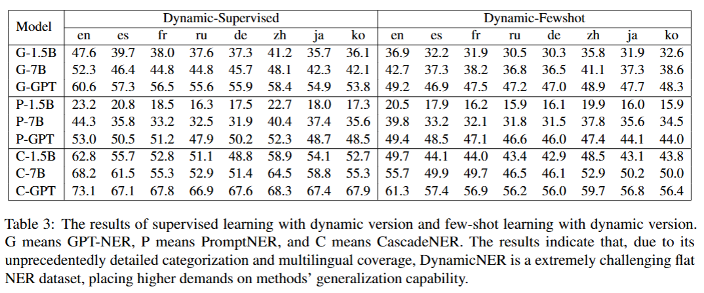

# DynamicNER: A Dynamic, Multilingual, and Fine-Grained Dataset for LLM-based Named Entity Recognition
This repository is supplement material for the paper: [DynamicNER: A Dynamic, Multilingual, and Fine-Grained Dataset for LLM-based Named Entity Recognition](https://arxiv.org/abs/2409.11022). This is accpeted by EMNLP 2025 Main Conference.

## 💓Update!
* Our paper is accpeted by EMNLP 2025!!!

* We add more existing open-source datasets in our format and also the format for fine-tuning and inferrence based on SWIFT! You can test CascadeNER easier!

* We discover a problem that as SWIFT has been updated and some parameters has been changed, so please use the old version (according to requirements.txt).

* We provide `demo.py` for testing CascadeNER easier.

## 📚 Features
* This repository includes DynamicNER and CascadeNER, our NER dataset and framework.

* DynamicNER is the first dataset specially designed for NER with LLMs with a novel dynamic categorization system. It's multilingual and fine-grained.

* CascadeNER is the first universal and multilingual NER framework with SLMs, which supports both few-shot and zero-shot scenarios and achieves SOTA performance on low-resource and fine-grained datasets

## 📈 Quantitive Result:

  

## 📌 Prerequisites

1. `conda create -n dynamicner python=3.10`
2. `pip install -r requirements.txt`
3. You may also use a standard environment for [SWIFT](https://github.com/modelscope/ms-swift).
4. You may also download `./DynamicNER.7z` and unzip it to obtain the dataset for training.

## 🌟 Usage
* **Dataset preparation**: the `DynamicNER_process` directory contains the scripts for generating dynamic datasets, running format conversions, and validating labels. See `DynamicNER_process/readme.md` for the full checklist (including `check_dynamic_classify.py`, `prune_dynamic_classify.py`, and `sync_extract.py`).

* **Training data**: please use [SWIFT](https://github.com/modelscope/ms-swift) for model training. We strongly recommend Qwen series for your base models. You may follow the examples in any `train.json` from BASE-format datasets on Hugging Face to understand the training layout. A concrete example is provided in `./DynamicNER_process/example.json`.

* **CascadeNER inference**: Stage-1 extraction, Stage-2 classification, and evaluation are documented in `./CascadeNER/README.md`. Configure paths via CLI arguments/environment variables rather than editing the scripts directly. Typical usage involves running `extract.sh`, then `python model/infer.py`, and finally `python evaluate.py`.

* **Transformation utilities**: to transform your own corpora into SWIFT/BIO formats, use `./DynamicNER_process/transformation/stage1_trans.py` and `stage2_trans.py`; BIO exports are handled by `BIO_trans.py` (and `BIO_trans_zh.py`).

* PS: Due to the update of SWIFT, you may need to use the old version to directly use our code, or you can modify the code slightly with the guidance from [SWIFT](https://github.com/modelscope/ms-swift). We will later provide a updated version of code for this problem.

## ❤️ Acknowledgement
* We thank QwenLM for opening source their [Qwen](https://github.com/QwenLM/Qwen) model for us
* We thank ModelScope for opening source their [SWIFT](https://github.com/modelscope/ms-swift) framework for us
* We thank teams of CoNLL2003, CrossNER, FewNERD, MultiCoNER and PAN-X for opening source their datasets
